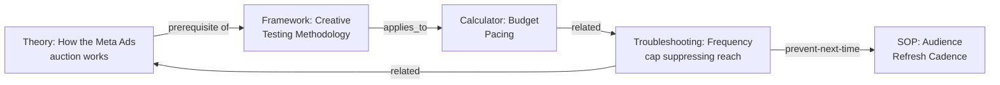
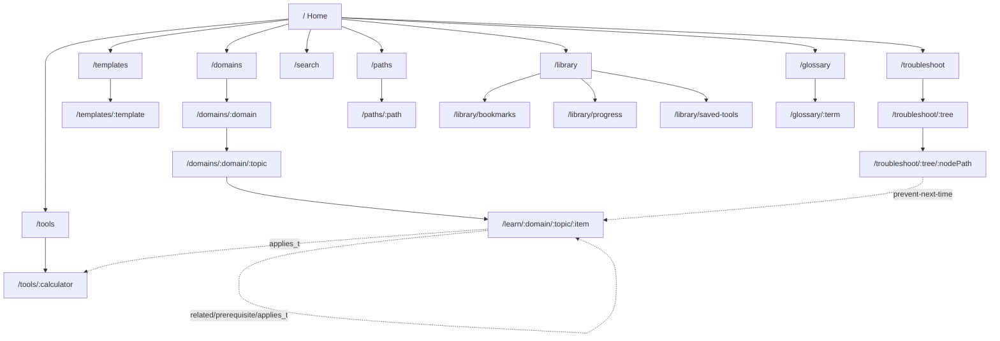

# MarketingOS — Information Architecture

## Version 2.0 (Complete, Blueprint Stage)

> **Status: Blueprint stage. No implementation code exists yet.** This document supersedes v1.0 and is now the complete, canonical Information Architecture for MarketingOS. Section numbers `§1`, `§3.3`, `§3.4`, `§4`, `§5`, `§6` are preserved exactly from v1.0 because `PRD.md`, `SYSTEM_DESIGN.md`, `ROADMAP.md`, and `CONTENT_GOVERNANCE.md` already cross-reference them — everything in `§7` onward is new.

The [`KNOWLEDGE_ARCHITECTURE.md`](./KNOWLEDGE_ARCHITECTURE.md) document defines how content is *authored* (a strict tree: Domain → Topic → Module → Item). This document defines how humans actually *find and move through* it — which is not one structure but three overlapping organization systems (§2.1), reached through six parallel entry models (§1), because a Media Buyer at 11pm with a broken campaign and a Marketing Director planning next quarter's strategy do not think about the same content the same way.

---

# 1. Six Navigation Models (Entry Points)

MarketingOS exposes six parallel ways into the same content graph. Every content item is reachable from all applicable models — there is no single "correct" path, and no model is subordinate to another in the primary UI.

| # | Model | Entry question | Primary users |
|---|---|---|---|
| 1 | **By Domain** | "Show me everything about Performance Marketing" | New users exploring, researchers |
| 2 | **By Skill Level** | "I'm an Intermediate performance marketer — what's my curriculum?" | Learners on a deliberate path |
| 3 | **By Role** | "I'm a Media Buyer — curate this for me" | New users at onboarding |
| 4 | **By Content Type** | "I just need a calculator / template / checklist" | Users mid-task, high urgency |
| 5 | **By Problem (search)** | "My ROAS dropped" / "how do I price a retainer" | Users mid-crisis or mid-decision |
| 6 | **By Job-to-be-done** | "I'm planning next quarter" / "I'm launching a new channel" | Users starting a defined work project |

Models 4 and 5 are the highest-frequency, lowest-friction paths and are therefore first-class in the primary navigation UI (not buried under "Browse") — this reflects the "usable mid-task, not just study material" product principle in `PRD.md §2` (Goal G5).

## 1.1 Findability Matrix

A concrete decision table — for every example task, which model resolves it and which page template (§3) it lands on. Used to sanity-check that every real task has a short path, not just that the taxonomy is theoretically complete.

| Example task | Resolving model | Destination template |
|---|---|---|
| "My ROAS dropped overnight" | By Problem | Troubleshooting Guide (§3.5) |
| "I want to learn Meta Ads from scratch" | By Domain | Domain Hub (§3.2) → Curriculum Map |
| "I'm a new Media Buyer, orient me" | By Role | Onboarding (§3.1) → Role Path (§9) |
| "I just need the CAC formula right now" | By Content Type | Tools Index → Calculator (§3.4) |
| "What does MER mean?" | By Problem / Glossary | Glossary Term page |
| "I'm planning Q3, give me a framework" | By Job-to-be-done | Framework content item, surfaced via Domain Hub "core frameworks" rail |
| "Show me only Advanced content in CRM" | By Skill Level + facet filter | Domain Hub with level facet applied (§8) |
| "I bookmarked something last week, where is it" | Personal | `/library` (§3.6) |

---

# 2. Organization Systems, Site Map & Routing

## 2.1 Three Organization Systems

MarketingOS content is organized three different ways simultaneously; each serves a different navigational need, and the architecture keeps them explicitly distinct rather than collapsing them into one structure:

| System | Structure | Serves | Where it's authored |
|---|---|---|---|
| **Hierarchical (exact)** | Domain → Topic → Module → Item — single primary parent per item | Breadcrumbs, domain browsing, curriculum maps | The content item's `domain`/`topic`/`module` fields (`KNOWLEDGE_ARCHITECTURE.md §4`) |
| **Hypertext (graph)** | Cross-links: `prerequisites`, `related_items`, `applies_to_calculators/templates` — no single parent, many-to-many | "Go deeper," "read this first," "use this tool now" — the associative, non-linear browsing real users do (§7) | The same metadata schema's link fields |
| **Database-driven (faceted)** | Independent metadata dimensions: `type`, `skill_levels`, `tags` | Search filtering, "browse by type," "browse by level" (§8) | Same schema, treated as independent facets rather than hierarchy |

No content item is only in one system — every item has a hierarchical position *and* graph edges *and* facet values simultaneously. This is what makes six navigation models (§1) possible from one underlying content model.

## 2.2 Complete Site Map

Full page inventory, including index/list pages, personal-layer pages, and state pages — not just the primary content routes:

```
/                              Home (logged-out: value-prop + 6 entry points; logged-in: personalized dashboard, PRD §21)
/welcome                       Onboarding — role selection
/welcome/level                 Onboarding — per-domain skill level selection
/welcome/done                  Onboarding — confirmation + generated Role Path preview

/domains                       Domain index (all 14, "coming soon" state for unbuilt domains — §3.9)
/domains/:domain               Domain hub — curriculum map, core frameworks, tools, topic list
/domains/:domain/:topic        Topic page — module list within the topic

/learn/:domain/:topic/:item    Content item page (universal template, §3.3) — canonical URL for all 11 content types except calculators/templates, which have their own top-level routes below

/tools                         Tools index (all calculators, filterable by domain/level)
/tools/:calculator             Calculator page (§3.4)
/templates                     Templates index (all downloadable/fillable templates)
/templates/:template           Template detail + download

/troubleshoot                  Troubleshooting/decision-tree index (browse by symptom)
/troubleshoot/:tree            Decision tree entry (first question)
/troubleshoot/:tree/:nodePath  Deep-linkable decision tree node (§3.5) — nodePath encodes the answer sequence

/paths                         Learning paths index (Role Paths + Level Paths, §9)
/paths/:path                   Path player — ordered step navigator

/search                        Search results (`?q=&domain=&type=&level=&tag=`, §4)

/glossary                      Glossary index (A–Z + search-within)
/glossary/:term                Glossary term page (renders through the universal content template, §3.3, type=glossary)

/library                       Personal layer landing (§3.6)
/library/bookmarks             Bookmarked items
/library/progress              Per-domain progress ladders
/library/saved-tools           Saved calculator results

/account                       Profile
/account/role                  Change stated role
/account/levels                Change stated per-domain skill levels

/sitemap                       Human-readable sitemap page (supplemental navigation, §2.4) — not this document, the in-product page
```

State/edge pages (not distinct routes, but required states of the above — full detail in §3.9):
- 404 / not-found
- Deprecated-content redirect notice (reached via a stale inbound link, per `PRD.md §19` rule 4)
- Empty states: no bookmarks yet, no saved tools yet, domain not yet built, zero search results
- Loading/skeleton states for calculator recompute and search

## 2.3 URL & Routing Scheme

Principles:
* **Human-readable, hierarchical-looking URLs** for content items (`/learn/:domain/:topic/:item`) even though the underlying model also treats content as a graph (§2.1) — the URL reflects the *primary* hierarchical position for shareability/SEO, while in-page cross-links (§7) carry the graph relationships. A content item's canonical URL never changes based on how the user arrived at it.
* **Tools and templates get top-level routes** (`/tools/:calculator`, not `/learn/.../:calculator`) because Model 4 (by content type) users think of them as a distinct universe ("I need a calculator"), not as nested inside a domain they have to know first.
* **Decision trees are deep-linkable at every node** (`/troubleshoot/:tree/:nodePath`) so a terminal diagnosis can be shared directly — a hard requirement carried over from v1.0 (§3.5) and made concrete here as an actual URL shape.
* **Search and facet state live in the query string** (`?q=&domain=&type=&level=&tag=`), not the path, so search results are always a bookmarkable/shareable URL and facets can combine freely (§8) without a combinatorial explosion of path segments.
* **Slugs are stable once published**; if a content item is renamed, the old slug redirects rather than 404s (supports the "no dead ends" UX principle, §6.6, and the link-integrity rule in `PRD.md §19`).

## 2.4 Labeling System

Consistent vocabulary is what makes six navigation models feel like one product instead of six different mini-apps:

* **Domain names**: Title Case, 2–4 words, matching exactly the 14 names in `KNOWLEDGE_ARCHITECTURE.md §1` everywhere they appear (nav, breadcrumbs, badges, URLs-as-slugs) — never abbreviated or paraphrased differently in different surfaces.
* **Content type badges**: one fixed, short label per type (Theory, Framework, Calculator, SOP, Checklist, Decision Tree, Template, Case Study, Benchmark, Troubleshooting Guide, Glossary) — these 11 labels are a closed, controlled vocabulary; a new label is not introduced without adding a new type to `KNOWLEDGE_ARCHITECTURE.md §3` (governed in §12 below).
* **Skill level badges**: Beginner, Intermediate, Advanced, Senior, Expert — always this exact wording and order, never domain-specific synonyms.
* **Navigation labels**: nouns for destinations (Domains, Tools, Templates, Paths, Library), not verbs — except calls-to-action *within* a page, which are verb-first and specific ("Calculate," "Download template," "Start diagnostic," "Save result") rather than generic ("Submit," "Go").
* **No unexplained jargon in labels** — if a label requires a term a Beginner wouldn't know (e.g., "MER"), it links to or is accompanied by the Glossary definition rather than assuming familiarity.

---

# 3. Page Templates & Key User Flows

## 3.1 Onboarding

1. Role selection (from the 12 personas in the PRD, or "generalist/other").
2. Self-assessed skill level, per relevant domain (from `PRD.md §4`'s persona-domain mapping — only the 2–3 domains relevant to that role are asked about, not all 14).
3. System generates a starter Role Path (§9 below) and a personalized Home.

No sign-up wall to *read* content — onboarding builds a better experience but is not a gate to entry-level use (per Assumption #1 in `PRD.md`).

## 3.2 Domain Hub

Every domain hub page shows, in this order:
1. One-paragraph orientation ("what this domain covers and why it matters").
2. Curriculum map — a visual Beginner→Expert ladder with Topics as rungs, showing the user's current position if they're onboarded.
3. Core frameworks for the domain (the 3–5 "if you only know these, know these").
4. Tools available in this domain (calculators/templates), surfaced early — not buried at the bottom.
5. Topic list, each expandable into Modules.

If the domain has no published content yet (Phase 2+ domains before their build-out), the hub renders the "coming soon" state (§3.9) instead of 1–5, so it is never mistaken for a broken page.

## 3.3 Content Item Page (universal template)

Every content item, regardless of type, renders through one consistent template so users learn the page pattern once:

```
[Type badge] [Skill level badge(s)] [Last reviewed date]
Title
Summary (1–2 sentences, always visible, e.g. in search results/cards)
Body (structure varies by type — see KNOWLEDGE_ARCHITECTURE.md §3)
── Related tools (calculators/templates that operationalize this content) ──
── Related content (prerequisites, related items, "go deeper") ──
── Sources ──
[Bookmark] [Mark as learned] [Copy/Download if template]
```

Consistency here is a deliberate UX principle: scanability compounds across thousands of content items only if the shape never changes.

## 3.4 Calculator Flow

Input form (typed fields, sensible defaults where industry-standard) → instant recompute on input change (no submit button where feasible) → result with plain-language interpretation, not just a number → link to the Framework/Theory item behind the formula → "save this result" to `/library` → related SOPs/next actions.

## 3.5 Troubleshooting / Decision Tree Flow

Single starting question → branching Q&A (one question per screen, back button always available) → terminal node with: likely diagnosis, ranked list of causes, a fix (often linking an SOP), and a "prevent this next time" link (often linking a Checklist). Every terminal node is directly deep-linkable/shareable at its own URL (`/troubleshoot/:tree/:nodePath`, §2.3) — a user should be able to send a teammate straight to "you have a frequency problem" without replaying the whole tree.

## 3.6 Personal Library

Bookmarks, saved calculator results, per-domain progress against the skill ladder, and "recently viewed." This is what makes the product feel like *my* operating system rather than a static reference site — it is the retention mechanic, and per `PRD.md §11`, its usage (return visits, saved-item reuse) is a primary success metric.

## 3.7 Search Results Page

Facet sidebar (domain/topic/type/level/tag, multi-select, §8) + result list, each result rendered as a `ContentCard` (`PRD.md §22`) showing type badge, skill level, title, summary, and freshness. Results are grouped by relevance rank, not by type — a strict by-type grouping would fight the "problem-phrased query should surface a Troubleshooting Guide first" ranking rule (§4). A "did you mean a tool?" prompt appears above results when the query pattern matches a known tool name.

## 3.8 Account / Settings

Single page, three sections: Profile (email, nothing else in V1 per the thin personalization scope in `SYSTEM_DESIGN.md §6`), Role (change stated role — re-triggers Role Path suggestion), Skill Levels (per-domain sliders/selectors, same control used at onboarding §3.1 step 2, reusable rather than a separate one-off settings widget).

## 3.9 Index Pages (Tools, Templates, Troubleshoot, Glossary, Domains)

Five index pages share one pattern: a filterable grid/list of `ContentCard`s scoped to one facet (content type, or "all domains"), with the same facet sidebar as Search (§3.7) pre-scoped. The Domain index additionally shows a "coming soon" card style (per §3.2) for any of the 14 domains without published content yet, so Phase 1's 3-domain reality is honest in the UI rather than hidden or presented as broken links.

## 3.10 Empty & Error States

| State | Where | Treatment |
|---|---|---|
| No bookmarks yet | `/library/bookmarks` | Prompt pointing at the bookmark action on a content page, not a bare "nothing here" |
| No saved tools yet | `/library/saved-tools` | Prompt pointing at "save this result" on a calculator (§3.4) |
| Zero search results | `/search` | Suggest removing the most restrictive active facet; surface the Domain index and Tools index as fallbacks — never a dead end (§6.6) |
| Domain not yet built | `/domains/:domain` | "Coming soon" card, per §3.2/§3.9, with an estimated phase if known (`ROADMAP.md`) — not a 404 |
| Deprecated content reached via stale link | `/learn/...` resolving to a `deprecated` item | Visible banner: "This has been superseded," linking to its replacement if one exists, content still rendered below (link-integrity rule, `PRD.md §19`) |
| Unknown route | any | 404 page with search bar and the six navigation models (§1) as recovery options, not just a "go home" link |

## 3.11 Sitemap Page

`/sitemap` — the one page that renders the full hierarchical organization system (§2.1) as a literal expandable tree, Domain → Topic → Module → Item titles, all linked. This is supplemental navigation (Rosenfeld/Morville sense): it exists for the minority of users who want to see the whole structure at once, and as a fallback when the other five navigation models haven't gotten someone where they need to be.

---

# 4. Search System Architecture

* **Indexing**: full-text index built from the content layer's metadata (domain/topic/module/type/skill_levels/tags) and body text, rebuilt on every publish (`SYSTEM_DESIGN.md §5`).
* **Query types** the system explicitly designs for, not just generic keyword matching:
  * *Direct tool queries* ("CAC calculator") → type-ahead surfaces the matching calculator/template above article results.
  * *Problem-phrased queries* ("ROAS dropped," "email open rate low") → ranked toward Troubleshooting Guides / Decision Trees over generic Theory articles, via curated query→content mappings in V1 (`PRD.md §20`, FR-021), semantic search in Phase 3 (`ROADMAP.md`).
  * *Definitional queries* ("what is MER") → ranked toward the matching Glossary term.
  * *Exploratory queries* ("Meta Ads") → ranked toward the Domain Hub / Topic page over any single content item.
* **Facet filters**: domain, topic, type, skill level, tag — combinable, detailed in §8.
* **Ranking signals**: text-match relevance; skill-level match to the user's stated level (boost, not filter — an Intermediate still sees Advanced results, just not forced to the top); freshness (recently-reviewed content ranks slightly above stale-but-not-deprecated content at equal relevance); query-type override (problem-phrased queries boost Troubleshooting/Decision Tree types per above).
* **Zero-result handling**: see §3.10 — never a bare empty page.
* **Search is persistent, global UI** (§1), not a hidden icon — reflecting that "by problem" is a top-frequency navigation model, not an edge case.

---

# 5. Personalization Model (V1 scope)

V1 personalization is **explicit, not inferred**: users set role + skill level themselves (and can change it anytime, via `/account`, §3.8), and the system uses that to:
* Order/filter the Domain Hub curriculum map to their level.
* Pre-select a Role Path at onboarding (§9).
* Sort search results to prefer their stated level (without hiding other levels).

Inferred/adaptive personalization (based on behavior, quiz results, etc.) is explicitly deferred to `ROADMAP.md` Phase 3 — "Adaptive IA," where path recommendations and possibly navigation emphasis respond to actual usage rather than only self-reported state. Building it in V1 would require behavioral data the product hasn't yet collected, and risks personalizing on noise.

---

# 6. UX Design Principles

1. **30-second rule** — any calculator, checklist, or SOP must be usable by a returning user in under 30 seconds without re-reading instructions.
2. **Progressive disclosure** — Beginner-level users are never dropped into Expert content by default navigation; it's reachable, never forced.
3. **Consistent templates over creative layouts** — the content item template (§3.3) and calculator template (§3.4) are fixed shapes; visual variety happens within them, not to them.
4. **Mobile-usable, not mobile-first** — the primary work context is a desktop during work hours, but troubleshooting/reference lookups happen on mobile; calculators and troubleshooting flows must degrade gracefully to small screens, dense domain hub maps can be desktop-optimized (full treatment in §10).
5. **Dark mode as a first-class theme**, not an afterthought — professionals reference this tool at all hours.
6. **No dead ends** — every terminal page (calculator result, decision-tree outcome, glossary term, empty state, 404) always surfaces a "next" link or recovery option (§3.10); the product should never leave a user at a page with nothing else to do.
7. **Findability over cleverness** — a novel or clever navigation pattern is rejected in favor of the boring, findable one; all six models (§1) exist because different users search differently, not because variety is a goal in itself.
8. **One primary action per page** — a calculator's primary action is computing a result, a decision-tree node's is answering the question, a content item's is reading/bookmarking; secondary actions (share, download, related links) never visually compete with the primary one.

---

# 7. Content Relationship Model (Internal Linking)

The hypertext organization system (§2.1) made concrete. Every content item carries typed, structured link fields (`KNOWLEDGE_ARCHITECTURE.md §4`) rendered in fixed positions on the universal template (§3.3):

| Edge type | Field | Rendered as | Direction |
|---|---|---|---|
| Prerequisite | `prerequisites` | "Read this first" banner above the body | One-way (A requires B does not imply B requires A) |
| Association | `related_items` | "Related content" rail below the body | Conceptually bidirectional — if A relates to B, B should relate to A; enforced by the link-integrity check in `PRD.md §19` |
| Tool application | `applies_to_calculators` / `applies_to_templates` | "Related tools" rail, positioned *above* "Related content" since tools are higher-urgency (Product Principle 1) | Bidirectional — a calculator also links back to the theory/framework it implements |
| Diagnosis → prevention | Troubleshooting/Decision-Tree terminal node → SOP/Checklist | "Prevent this next time" link at the terminal node (§3.5) | One-way |

Example graph fragment (illustrative, not the full corpus):



**Rules** (restated from `PRD.md §19` as the canonical IA-level spec, since this is where they're implemented):
1. No orphan content — every published item has at least one inbound link (from an index page, a `related_items`/`prerequisites` edge, or a Learning Path) or it fails publish validation.
2. Cross-domain links are expected, not an exception — a Copywriting Framework linking to a Psychology Theory item is the graph working as designed, not a taxonomy leak.
3. Link integrity is checked at every content build; a broken internal link fails validation exactly like a missing metadata field.
4. Content with inbound links only from `deprecated` items is flagged in the periodic link audit (`CONTENT_GOVERNANCE.md`) — it behaves like an orphan even though it technically has an inbound edge.

---

# 8. Faceted Classification & Metadata for Filtering

The database-driven organization system (§2.1) made concrete.

* **Facet dimensions**: `domain`, `topic`, `type` (the 11 content types), `skill_levels`, `tags`.
* **Domain/topic/type/skill_levels are controlled vocabularies** — fixed, closed lists (14 domains, N topics per domain as defined during content planning, 11 types, 5 levels) — a content author cannot invent a new value inline; new values go through IA Governance (§12).
* **`tags` are a semi-controlled vocabulary**, not free-tagging: an author can only apply tags from a maintained per-domain tag list, growing deliberately over time rather than accumulating one-off synonyms (e.g., "paid-social" vs "paid social" vs "social-ads" would each fragment the facet if unconstrained) — this is a deliberate constraint to keep facets useful as the corpus scales into the thousands of items (`PRD.md §26`).
* **Facet UI behavior**: multi-select within a dimension is OR logic ("Beginner" OR "Intermediate"); across dimensions is AND logic (domain=Performance-Marketing AND type=Calculator); facets update result counts live rather than requiring a re-search action.
* **Facets are reused, not reimplemented, across surfaces** — the same facet sidebar component powers Search (§3.7), the Domain index, and every content-type index page (§3.9), so filtering behavior is learned once.

---

# 9. Learning Paths as an IA Construct

A Learning Path is an ordered sequence of content-item references that crosses the hierarchical structure (§2.1) freely — it is a fourth, purpose-built organization system layered on top of the other three, existing specifically to turn the graph back into a guided curriculum when a user wants one rather than to browse it themselves.

* **Role Paths** — curated per persona, spanning that persona's primary + secondary domains (`PRD.md §4`); generated as a starter suggestion at onboarding (§3.1 step 3) based on the user's stated role.
* **Level Paths** — domain-agnostic, "everything a marketer needs to reach Intermediate across foundational domains," for generalists.
* **Path page anatomy** (`/paths/:path`): ordered step list with progress indicator, each step a `ContentCard` linking to its item's canonical URL (§2.3) — a path never forks content into a path-specific copy; it always points at the single canonical version so freshness/governance (`CONTENT_GOVERNANCE.md`) applies uniformly regardless of how content is reached.
* **V1 paths are curated, not algorithmic** — hand-ordered by the content owner. Adaptive path generation (reordering based on actual usage/performance) is explicitly a Phase 3 capability (`ROADMAP.md`), consistent with the personalization model in §5.

---

# 10. Mobile & Responsive IA

* **Global navigation collapses** from a persistent top bar (desktop) to a bottom tab bar with the three highest-frequency destinations (Search, Tools, Library) plus a "More" overflow for Domains/Paths/Account — prioritized by the same urgency ranking that puts Models 4–5 first in §1.
* **Calculators and troubleshooting flows are mobile-first in practice**, not just "responsive" — these are the two templates most likely to be opened mid-task away from a desk (per `PRD.md §4` JTBDs like Mona's 11pm ROAS crisis); single-column input forms, large tap targets, no hover-dependent interactions.
* **Domain hub curriculum maps are desktop-optimized** and degrade to a simplified vertical list on mobile (the visual ladder metaphor doesn't compress well to narrow viewports) — acceptable because domain exploration is a lower-urgency, more likely at-a-desk activity than tool use.
* **Search remains persistent** on mobile (a visible bar, not a collapsed icon) even though screen space is scarcer — consistent with §1's "search is first-class, not hidden" rule holding across breakpoints.
* **Decision trees** show one question per screen on both desktop and mobile already (§3.5), so this template requires no mobile-specific redesign — it was designed mobile-compatible from the start.

---

# 11. Accessibility & Wayfinding

* **Landmark regions** on every page: `header` (global nav), `nav` (breadcrumb), `main` (content), `aside` (facet sidebar / related-content rails where present), `footer` (supplemental nav, §2.2) — consistent across all templates so screen-reader users learn the structure once, same principle as §6.3 for sighted users.
* **Heading hierarchy** is fixed per template: content item title is always `h1`; type-specific body sections (e.g., an SOP's numbered steps) use `h2`/`h3` consistently regardless of domain, so heading-based screen-reader navigation is predictable.
* **Skip-to-content link** on every page, ahead of global nav, for keyboard/screen-reader users.
* **Breadcrumbs are a real `nav` landmark with `aria-label="breadcrumb"`**, not decorative text — they are the primary hierarchical-wayfinding mechanism (§2.1) and must be programmatically discoverable, not just visually present.
* **Decision-tree flow focus management** (§3.5): each new question receives programmatic focus on render, and the back action returns focus to the previous question's selected answer, so keyboard/screen-reader users don't lose their place in a multi-step flow the way a sighted user tracking visual position would not.
* **Facet filters (§8)** are operable via keyboard alone and announce result-count changes (`aria-live`) when facets update live, since the UI behavior is explicitly "update without an explicit search action."

---

# 12. IA Governance & Extensibility

The taxonomy and navigation structure are designed to grow (14 domains, more topics/modules, eventually more tags) without periodic redesign. Concretely:

* **Adding a 15th domain** (beyond the current 14, hypothetically): requires updating the controlled vocabulary in `KNOWLEDGE_ARCHITECTURE.md §1` and the persona-domain matrix (`PRD.md §4`), but requires **zero changes** to routing (§2.3), page templates (§3), search (§4), or facets (§8) — they're all domain-agnostic by construction. This is the concrete test of NFR-07 in `PRD.md §10`.
* **Adding a 12th content type**: higher-cost than a new domain — requires a new entry in the controlled vocabulary (§2.4), a new authoring template (`KNOWLEDGE_ARCHITECTURE.md §3`), and a decision about where it renders within the universal content template (§3.3)'s body slot. Governed deliberately (not left to ad hoc author decision) because content types drive UI rendering logic, unlike domains/tags which are pure metadata.
* **Adding a new tag**: lowest-cost, but still goes through the semi-controlled process in §8 rather than free-form — a maintained per-domain tag list, reviewed periodically as part of `CONTENT_GOVERNANCE.md`'s editorial process, to prevent facet fragmentation as the corpus scales.
* **Retiring/merging taxonomy values** (a topic turns out to be miscategorized, two tags turn out to be synonyms): treated as a content migration, not a silent rename — affected content items are bulk-updated and old slugs redirect (§2.3), never silently orphaned.

---

# 13. Validation Plan

The IA in this document is a design hypothesis until tested against real users. Recommended validation, sequenced against `ROADMAP.md`:

* **Before Phase 1 launch**: first-click testing on the Findability Matrix tasks (§1.1) — for each example task, do real target users click toward the right destination on their first try from Home? A high miss rate on any task is a signal to relabel or restructure, not to add more onboarding copy explaining the existing structure.
* **Before Phase 1 launch**: tree testing (structure-only, no visual design) on the Domain → Topic → Module hierarchy for the 3 flagship domains specifically, since that hierarchy drives breadcrumbs and the Domain Hub curriculum map that Phase 1 depends on.
* **During Phase 1**: search-log analysis — zero-result queries and queries followed by an immediate re-search (the inverse of the search-success metric in `PRD.md §11`) are the cheapest, highest-signal ongoing IA validation once there's real usage.
* **Before Phase 2 (horizontal expansion)**: revisit the tag vocabulary (§8) and topic/module breakdowns for the remaining 11 domains against what was actually learned from Phase 1 usage, rather than assuming the Phase 1 pattern transfers unchanged — card sorting with subject-matter reviewers is appropriate here if any domain's topic breakdown is contested.

---

# 14. Sitemap Diagram

Top-level structure (illustrative — full inventory in §2.2):



The dotted edges represent the hypertext organization system (§2.1/§7) cutting across the solid hierarchical routes — the reminder that this sitemap is a navigable tree for wayfinding purposes, not a description of how content is actually related.
